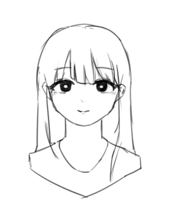

# 흉상 일러스트
### 오늘은 낙서하는 김에 흉상까지 나온 그림 하나를 그렸다.
요즘은 완성작의 퀄리티가 만족스럽지 않아서 제대로 된 그림을 못 그린다. 너무 눈이 높아진 것 같다. 흉상을 그리는 것은 일종의 습관이 되었다. 전신같이 어렵지 않고, 신체 비율을 별로 생각하지 않아도 돼서 이런 안좋은 습관이 생긴 것이다.. 
 그리다보니 다른 안 좋은 습관도 몇 개를 찾았는데 다음은 고쳐야 할 습관이다.
### 안좋은습관 리스트
- 그림을 그릴 때 기초 스케치를 제대로 못 하는 것(연습이 필요하다)
- 그림이 자꾸 과도하게 비대칭이 되는 것(이건 그림 그릴때 고개를 살짝 돌리거나 몸을 돌리는 습관이 있는 듯 하다.)
- 전신 일러스트를 안 그리는 것
> 계속해서 의식을 하고 고쳐나가야겠다.
### 다음은 오늘 그렸던 흉상 일러스트이다.
